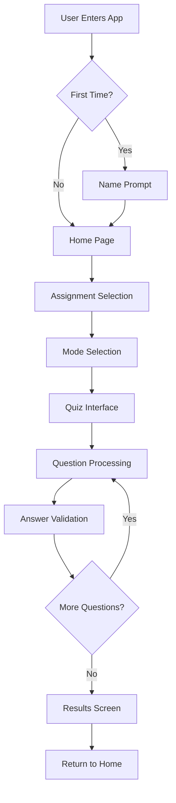

# Design Document

## Overview

The ML Quiz Application is a Next.js-based educational tool that helps students memorize machine learning concepts through interactive quizzes. The application features multiple learning modes, real-time feedback, progress tracking, and personalized experiences. Built with vanilla JavaScript and Tailwind CSS, it provides a clean, responsive interface that works across devices.

## Architecture

### Application Structure
```
ml-quiz-app/
├── app/
│   ├── layout.js                 # Root layout with global styles
│   ├── page.js                   # Home page with assignment selection
│   ├── assignment/
│   │   └── [id]/
│   │       └── page.js           # Assignment mode selection
│   └── quiz/
│       └── [assignment]/
│           └── [mode]/
│               └── page.js       # Quiz interface
├── components/
│   ├── AssignmentCard.js         # Assignment selection cards
│   ├── ModeSelector.js           # Learning mode selection
│   ├── QuizInterface.js          # Main quiz component
│   ├── ProgressBar.js            # Progress tracking component
│   ├── QuestionCard.js           # Individual question display
│   ├── OptionButton.js           # Answer option component
│   ├── ResultsScreen.js          # Score and completion display
│   └── NamePrompt.js             # First-time user name input
├── utils/
│   ├── dataLoader.js             # Question data management
│   ├── quizLogic.js              # Quiz state and scoring logic
│   ├── shuffleUtils.js           # Question and option shuffling
│   └── storageUtils.js           # Local storage management
└── public/
    └── data.json                 # Question database
```

### Data Flow Architecture


## Components and Interfaces

### Core Components

#### 1. QuizInterface Component
**Purpose:** Main quiz orchestrator that manages question flow, timing, and state
**Props:**
- `assignment`: Assignment number (1-7)
- `mode`: Learning mode ('learn', 'test-easy', 'test-difficult')
- `questions`: Array of question objects

**State Management:**
```javascript
const [currentQuestionIndex, setCurrentQuestionIndex] = useState(0);
const [selectedAnswers, setSelectedAnswers] = useState([]);
const [showFeedback, setShowFeedback] = useState(false);
const [startTime, setStartTime] = useState(null);
const [userAnswers, setUserAnswers] = useState([]);
const [isComplete, setIsComplete] = useState(false);
```

#### 2. QuestionCard Component
**Purpose:** Displays individual questions with options and handles answer selection
**Props:**
- `question`: Question object with text, options, and metadata
- `mode`: Current learning mode
- `onAnswerSelect`: Callback for answer selection
- `selectedAnswers`: Currently selected answer indices
- `showFeedback`: Boolean to show correct/incorrect highlighting

**Features:**
- Supports both single and multiple-choice questions
- Dynamic option rendering with proper input types (radio/checkbox)
- Image support for questions with visual content
- Accessibility features with proper ARIA labels

#### 3. ProgressBar Component
**Purpose:** Visual progress indicator with question tracking
**Props:**
- `current`: Current question number
- `total`: Total number of questions
- `percentage`: Completion percentage

**Design:**
- Clean, minimalist progress bar with Tailwind styling
- Question counter display (e.g., "Question 5 of 10")
- Smooth animations for progress updates
- Mobile-responsive design

#### 4. ResultsScreen Component
**Purpose:** Displays final scores, time taken, and personalized messages
**Props:**
- `score`: Final score object with correct/total counts
- `timeElapsed`: Total time taken in seconds
- `userName`: User's stored name for personalization
- `onRestart`: Callback to restart quiz
- `onHome`: Callback to return home

### Data Models

#### Question Model
```javascript
{
  assignmentnumber: "1",
  questionnumber: "1", 
  question: "Question text here",
  image: "image-filename.jpg" | "",
  options: [
    {
      optionnumber: "A",
      optiontext: "Option text",
      iscorrect: true | false
    }
  ]
}
```

#### Quiz State Model
```javascript
{
  assignment: number,
  mode: 'learn' | 'test-easy' | 'test-difficult',
  questions: Question[],
  currentIndex: number,
  userAnswers: UserAnswer[],
  startTime: Date,
  isComplete: boolean
}
```

#### User Answer Model
```javascript
{
  questionId: string,
  selectedOptions: string[], // Array of option numbers
  isCorrect: boolean,
  timeSpent: number
}
```

## User Interface Design

### Design System

#### Color Palette
- **Primary:** Blue-600 (#2563eb) for main actions and progress
- **Success:** Green-500 (#10b981) for correct answers
- **Error:** Red-500 (#ef4444) for incorrect answers
- **Neutral:** Gray-100 to Gray-900 for text and backgrounds
- **Background:** White with subtle gray accents

#### Typography
- **Headings:** font-bold, text-xl to text-3xl
- **Body:** font-medium, text-base
- **Options:** font-normal, text-sm to text-base
- **Buttons:** font-semibold, text-sm

#### Spacing and Layout
- **Container:** max-w-4xl mx-auto for main content
- **Padding:** p-4 to p-8 for sections
- **Margins:** mb-4 to mb-8 for vertical spacing
- **Grid:** CSS Grid for assignment cards, Flexbox for quiz layout

### Screen Layouts

#### Home Page Layout
```
┌─────────────────────────────────────┐
│           ML Quiz App               │
│        Welcome, [Name]!             │
├─────────────────────────────────────┤
│  Select Assignment:                 │
│                                     │
│  [1] [2] [3] [4] [5] [6] [7]       │
│                                     │
│  Assignment cards in responsive     │
│  grid layout                        │
└─────────────────────────────────────┘
```

#### Quiz Interface Layout
```
┌─────────────────────────────────────┐
│  Assignment 1 - Learn Mode          │
│  ████████████░░░░░░░░ 60%           │
│  Question 6 of 10                   │
├─────────────────────────────────────┤
│                                     │
│  Question text here...              │
│  [Image if present]                 │
│                                     │
│  ○ A. Option text                   │
│  ● B. Option text (selected)        │
│  ○ C. Option text                   │
│  ○ D. Option text                   │
│                                     │
│              [Next] [Skip]          │
└─────────────────────────────────────┘
```

### Responsive Design Strategy

#### Mobile (< 768px)
- Single column layout
- Larger touch targets for options
- Simplified navigation
- Stacked progress information

#### Tablet (768px - 1024px)
- Optimized spacing for touch interaction
- Two-column layout for assignment selection
- Maintained readability for questions

#### Desktop (> 1024px)
- Multi-column assignment grid
- Sidebar navigation potential
- Enhanced visual hierarchy
- Keyboard navigation support

## Answer Selection and Feedback Logic

### Single Choice Questions
- Use radio button inputs for exclusive selection
- Clear previous selection when new option is chosen
- Immediate visual feedback on selection

### Multiple Choice Questions
- Use checkbox inputs for multiple selection
- Allow toggling of individual options
- Validate that at least one option is selected

### Feedback Display Logic
```javascript
// Learn Mode: Pre-highlight correct answers
if (mode === 'learn') {
  showCorrectAnswers = true;
  allowAnswerChange = true;
}

// Test Modes: Show feedback after answer submission
if (mode.startsWith('test')) {
  showCorrectAnswers = showFeedback && hasAnswered;
  allowAnswerChange = !showFeedback;
}
```

### Color Coding System
- **Green (#10b981):** Correct answers
- **Red (#ef4444):** Incorrect selected answers
- **Blue (#2563eb):** Selected but not yet validated
- **Gray (#6b7280):** Unselected options

## Question Shuffling Algorithm

### Test Difficult Mode Implementation
```javascript
function shuffleQuestions(questions) {
  return [...questions].sort(() => Math.random() - 0.5);
}

function shuffleOptions(question) {
  const shuffledOptions = [...question.options].sort(() => Math.random() - 0.5);
  return {
    ...question,
    options: shuffledOptions
  };
}

function prepareQuestionsForMode(questions, mode) {
  let processedQuestions = [...questions];
  
  if (mode === 'test-difficult') {
    processedQuestions = shuffleQuestions(processedQuestions);
    processedQuestions = processedQuestions.map(shuffleOptions);
  }
  
  return processedQuestions;
}
```

## Scoring and Progress Tracking

### Scoring Algorithm
```javascript
function calculateScore(userAnswers, questions) {
  let correctCount = 0;
  
  userAnswers.forEach((userAnswer, index) => {
    const question = questions[index];
    const correctOptions = question.options
      .filter(opt => opt.iscorrect)
      .map(opt => opt.optionnumber);
    
    const isCorrect = arraysEqual(
      userAnswer.selectedOptions.sort(),
      correctOptions.sort()
    );
    
    if (isCorrect) correctCount++;
  });
  
  return {
    correct: correctCount,
    total: questions.length,
    percentage: Math.round((correctCount / questions.length) * 100)
  };
}
```

### Time Tracking
- Start timer when first question loads
- Track time per question for analytics
- Display total time on completion screen
- Format time as MM:SS for readability

## Error Handling

### Data Loading Errors
- Graceful fallback if data.json fails to load
- User-friendly error messages
- Retry mechanisms for network issues

### Invalid Question Data
- Validation of question structure on load
- Skip malformed questions with logging
- Ensure at least one correct answer per question

### User Input Validation
- Prevent submission without answer selection (test modes)
- Handle edge cases in multiple choice validation
- Sanitize and validate stored user names

## Testing Strategy

### Unit Testing
- Question shuffling algorithms
- Scoring calculation logic
- Answer validation functions
- Local storage utilities

### Component Testing
- QuestionCard rendering with different question types
- ProgressBar updates and animations
- ResultsScreen data display
- NamePrompt input validation

### Integration Testing
- Complete quiz flow from start to finish
- Mode switching and data persistence
- Assignment filtering and question loading
- Cross-browser compatibility testing

### User Experience Testing
- Mobile responsiveness across devices
- Accessibility with screen readers
- Performance with large question sets
- Edge cases like browser refresh during quiz

## Performance Considerations

### Data Management
- Load only required assignment questions
- Implement question preloading for smooth transitions
- Optimize image loading for questions with visuals
- Use React.memo for expensive component renders

### State Management
- Minimize re-renders with proper state structure
- Use useCallback for event handlers
- Implement debouncing for rapid user interactions
- Local storage optimization for user data

### Bundle Optimization
- Code splitting by assignment/mode
- Lazy loading of non-critical components
- Image optimization and lazy loading
- Minimize CSS bundle size with Tailwind purging